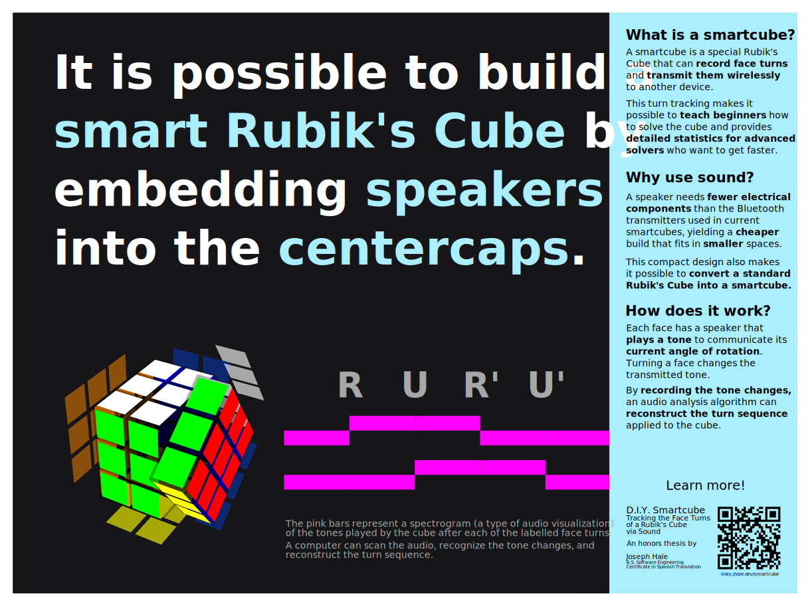

# D.I.Y. Smartcube

A proof-of-concept proposal for turning standard Rubik's Cubes into
smartcubes by embedding speakers into the cube's centercaps.

<!-- BADGES -->

---

*D.I.Y. Smartcube was created as part of Joseph Hale's undergraduate
honors thesis in Software Engineering for Barrett, The Honors College
at Arizona State University from Spring 2020 through Spring 2022.*

## Introductory Poster

## Detailed Poster

## Video Explanation

https://youtu.be/fckqMlKTW2Q

## Abstract

Speedsolving, the art of solving twisty puzzles like the Rubik's Cube
as fast as possible, has recently benefitted from the arrival of
smartcubes which have special hardware for tracking the cube's face
turns and transmitting them via Bluetooth. However, due to their
embedded electronics, existing smartcubes cannot be used in
competition, reducing their utility in personal speedcubing practice.

This thesis proposes a sound-based design for tracking the face turns
of a standard, non-smart speedcube consisting of an audio processing
receiver in software and a small physical speaker configured as a
transmitter. Special attention has been given to ensuring that
installing the transmitter requires only a reversible centercap
replacement on the original cube. This allows the cube to benefit from
smartcube features during practice, while still maintaining compliance
with competition regulations.

Within a controlled test environment, the software receiver perfectly
detected a variety of transmitted move sequences. Furthermore, all
components required for the physical transmitter were demonstrated to
fit within the centercap of a Gans 356 speedcube.

## How to Use this Repository

This repository has a LOT of information at varying levels of complexity. I recommend reading the contents of this repository in the following order:

1. The [Summary Posterboard](./posterboard/posterboard.pdf) (1 page) used to explain the core concepts of the D.I.Y. Smartcube at an academic poster session.
2. The [Defense Presentation](./presentation/defense_presentation.pdf) (30 slides + commentary) used to provide a detailed overview of the proposal in my Honors Thesis Defense.
3. The [Thesis Document](./thesis/DIY-Smartcube_Hale_Spring_2022.pdf) (98 pages) containing the full proposal including requirements, designs, specifications, and examples.

## License
Copyright (c) 2022-2024 Joseph Hale, All Rights Reserved

Provided under the terms of the [Mozilla Public License, version 2.0](./LICENSE)

<b>What does the MPL-2.0 license allow/require?</b>

### TL;DR

You can use files from this project in both open source and proprietary
applications, provided you include the above attribution. However, if
you modify any code in this project, or copy blocks of it into your own
code, you must publicly share the resulting files (note, not your whole
program) under the MPL-2.0. The best way to do this is via a Pull
Request back into this project.

If you have any other questions, you may also find Mozilla's [official
FAQ](https://www.mozilla.org/en-US/MPL/2.0/FAQ/) for the MPL-2.0 license
insightful.

If you dislike this license, you can contact me about negotiating a paid
contract with different terms.

**Disclaimer:** This TL;DR is just a summary. All legal questions
regarding usage of this project must be handled according to the
official terms specified in the `LICENSE` file.

### Why the MPL-2.0 license?

I believe that an open-source software license should ensure that code
can be used everywhere.

Strict copyleft licenses, like the GPL family of licenses, fail to
fulfill that vision because they only permit code to be used in other
GPL-licensed projects. Permissive licenses, like the MIT and Apache
licenses, allow code to be used everywhere but fail to prevent
proprietary or GPL-licensed projects from limiting access to any
improvements they make.

In contrast, the MPL-2.0 license allows code to be used in any software
project, while ensuring that any improvements remain available for
everyone.

